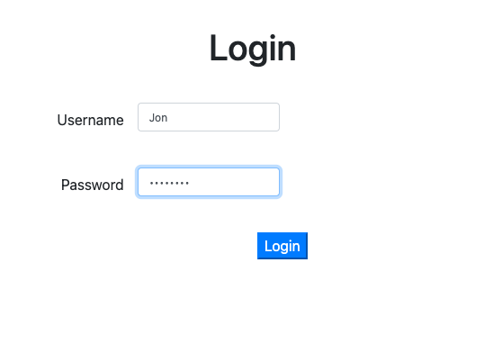
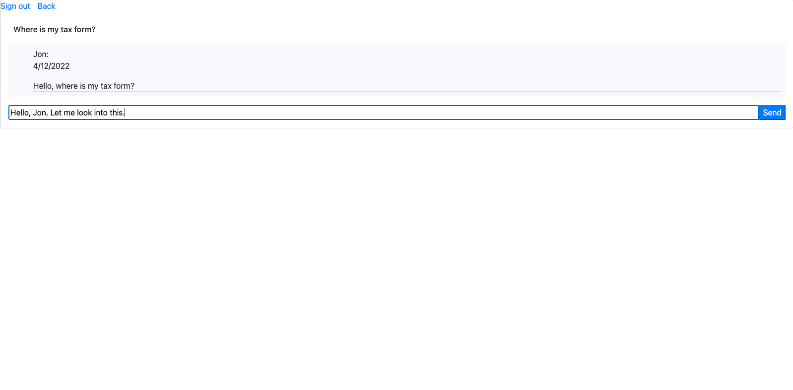
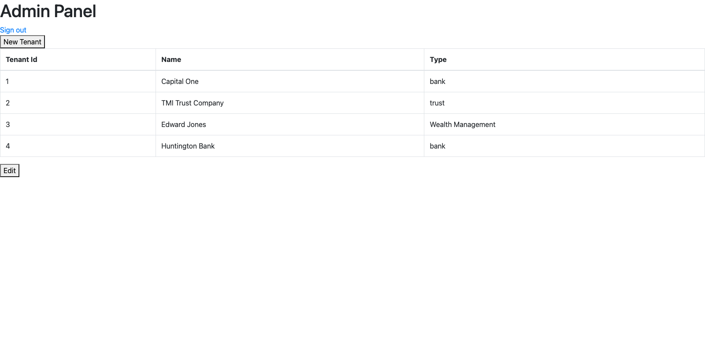
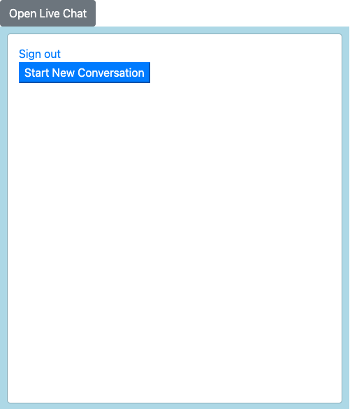
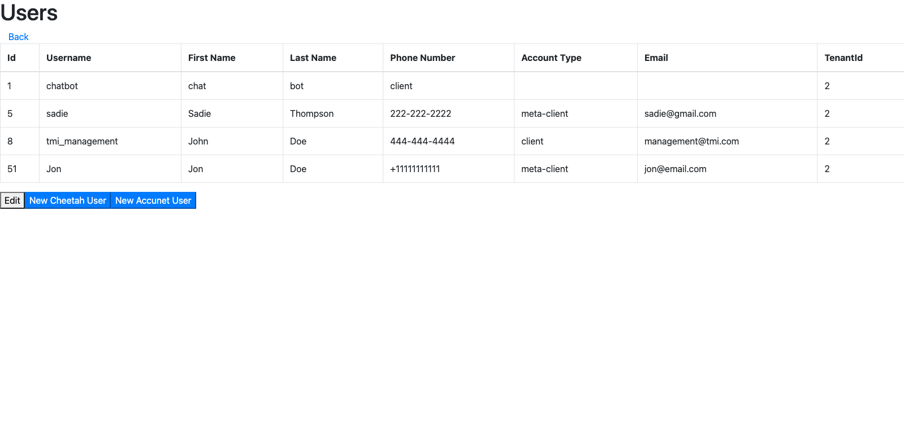

# User Documentation

## Getting Started

The secure sms chat plugin allows investors to communicate with their trust officers through a real-time messaging system. This manual shows how to use some of the major features of the software

To register for an account as a trust owner, navigate to http://localhost:8080/Register. Trust officer accounts can be created through the cheetah panel (http://localhost:8080/Cheetah). The register page allows users to enter a username, password, first and last name, and contact information. This system collects this information so it can notify users when they have a new message to read.

### The Accunet Chat Window

Once logged in, trust owners can view a mostly empty window with the option to create a new conversation. Clicking 'Create New Conversation' takes the user to the chat window The first input field is the subject for the conversation. Once the user enters a subject for the conversation, they can send a message to their trust officer. If you press back, you can see a list of conversations you created. Clicking on any of these will take you to the chat for that conversation.

</img>

### The Cheetah Chat Window

In this window the trust officers can respond to incoming messages. These messages will have a time stamp, the clients name, and the subject of the question. This window offers the ability to go back and sign out. 

</img>

### The Admin Panel

In the Admin Panel you can see a chart of the tenants information. This information includes their Tenant Id's, name of their organization (Capital One) for example, and the type (bank) for example. In this panel you can edit the chart, delete a tenant, add a new tenant, and sign out. 

</img>

### Accunet Panel 

After the client logs in they will be brough the the Accunet panel. This panel allows the client to open a live chat, start a new conversation, and sign out. 

</img>

### User Panel

</img>

