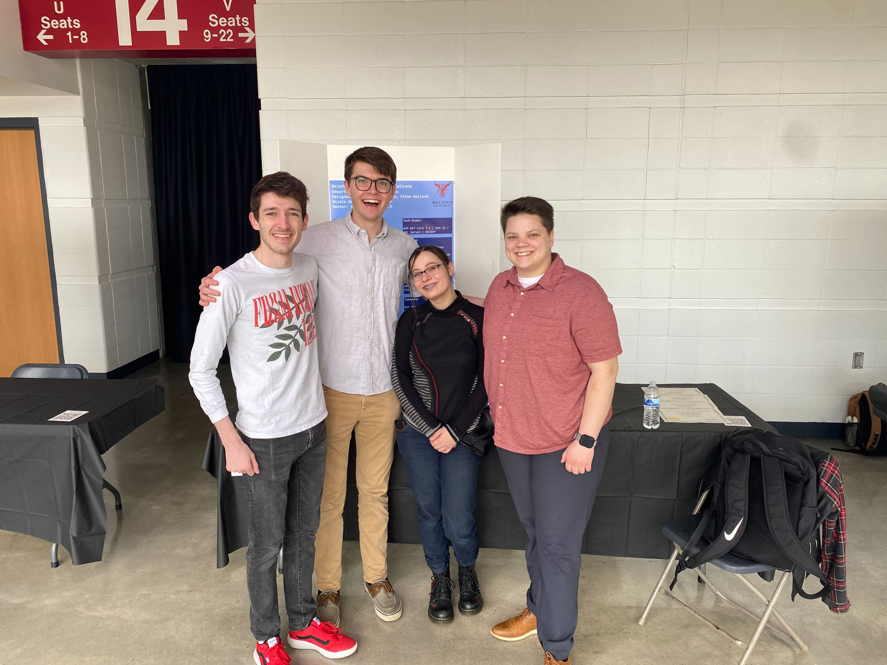
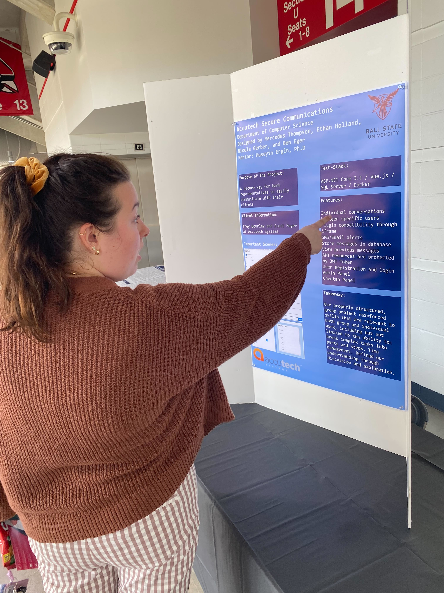
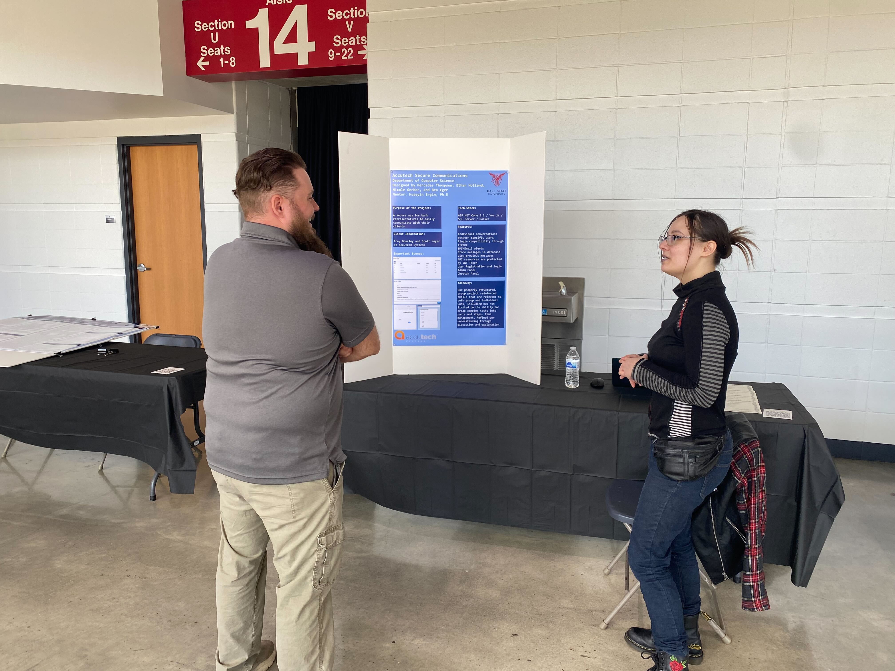
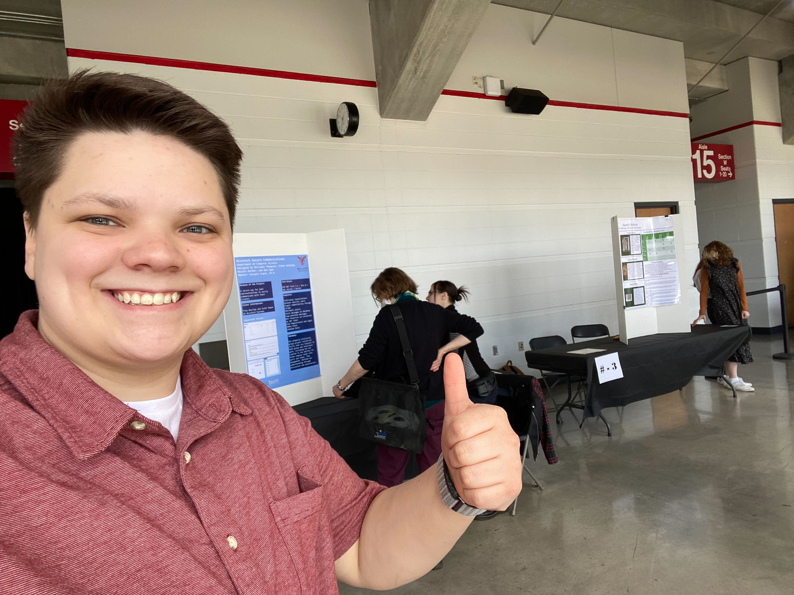
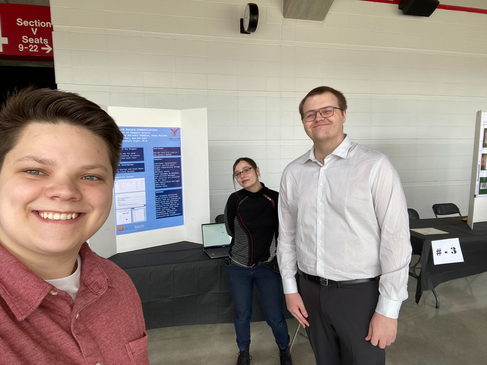
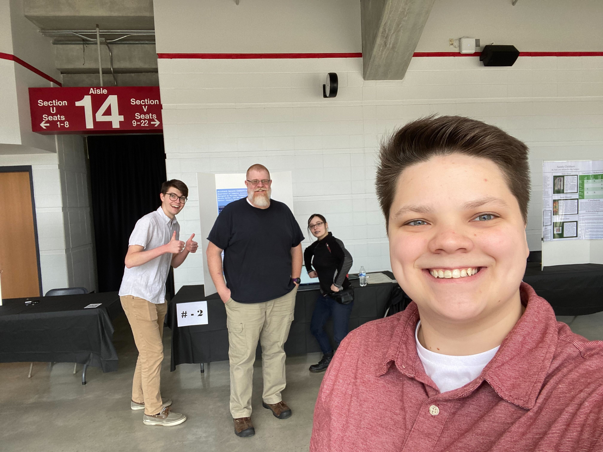

# Student Symposium

 
 
 

## People we talked with

### Rianna Schwartz

 

### Scott Hoover

 

### Ellen Thorington

 

### Keegan Maxwell

 

### Dwayne Lott

 

## Our Experience at the Symposium

### Ethan

### Sadie

### Nicole

I was first to the scene and for the first 10-15 minutes it was very quiet. It then started to pick up and my time there flew by. While I was alone I presented to Rianna Schwartz which was interesting to do because she had no clue what anything meant so it was fun to explain. Once Sadie showed up it started to get busy and we were talking with people the whole time till I had to leave to go to class. A lot of the people stopped at our project because we were associated with Accutech. One guy applied there and another guy used to work there. It was neat to hear their career stories and talk about our tech stack. 

### Ben

Honestly, I was a little disappointed by the symposium. I had hoped more people would come to see the projects and to network, but I enjoyed spending time with my peers from the capstone class and talking with the people who did come to the event. On the bright side, the experience challenged me to listen to people's questions and to think on my feet. Our team needed to find ways to explain the software to a general audience. This is always harder than it seems. I really do enjoy talking with people and getting to show off my hard work. It was also really enjoyable looking at other people's posters! 
